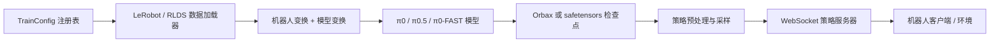

# openpi 项目文档

## 目标与范围

本仓库实现了开源的 π0、π0-FAST 和 π0.5 视觉-语言-动作模型，包括 JAX 与 PyTorch 训练路径、可复用的机器人专用变换、检查点加载，以及本地或远程策略服务。当前工作区还包含一套尚未提交的 AgiBot G01 机器人及其 LeRobot v2.1 数据集的 π0.5 适配。以下文档描述当前检出的代码，包括这些未提交文件；这并不表示 G01 适配已经合并或部署。

## 系统总览

图中每条边都对应明确的代码边界：配置与数据工厂位于 [`src/openpi/training/config.py`](../src/openpi/training/config.py)，加载器位于 [`src/openpi/training/data_loader.py`](../src/openpi/training/data_loader.py)，模型实现位于 [`src/openpi/models`](../src/openpi/models)，策略组装位于 [`src/openpi/policies/policy_config.py`](../src/openpi/policies/policy_config.py)，传输层位于 [`src/openpi/serving/websocket_policy_server.py`](../src/openpi/serving/websocket_policy_server.py)。

## 文档导航

| 文档 | 内容 |
| --- | --- |
| [架构](architecture.md) | 跨模块边界、训练调用链和推理调用链 |
| [数据与训练](modules/data-and-training.md) | 数据集构造、变换、归一化、优化、分片和检查点 |
| [推理与部署](modules/inference-and-deployment.md) | 策略构造、预处理、传输、客户端和运行时边界 |
| [AgiBot G01 实现](implementation/agibot-g01.md) | 精确的数据切片、π0.5 配置、ROS2 协议和安全行为 |
| [AgiBot G01 迁移指南](implementation/agibot-g01-pi05-migration-guide.md) | 从官方 openpi 逐步改到当前 G01 π0.5 适配的文件级指引 |
| [AgiBot G01 loss 尖峰排查](troubleshooting/agibot-g01-loss-spike-quantile-collapse.md) | `task_7792` 左夹爪 quantile range 塌缩的证据、排查代码和接续步骤 |
| [π0.5 流匹配原理](principles/pi05-flow-matching.md) | 训练目标、采样过程和 π0.5 专用条件输入 |
| [近期变更](CHANGELOG_RECENT.md) | 经整理的已提交历史，以及明确标注为未提交的 G01 适配 |

以下已有操作指南仍是对应专项流程的权威说明：

- [归一化统计量](norm_stats.md)
- [远程推理](remote_inference.md)
- [Docker 配置](docker.md)
- [AgiBot G01 命令](../examples/agibot_g01/README.md)

## 主要入口

| 命令或 API | 功能 |
| --- | --- |
| `uv run scripts/compute_norm_stats.py ...` | 计算机器人变换后的 state/action 统计量 |
| `uv run scripts/train.py <config> ...` | 执行 JAX 训练并创建 Orbax 检查点 |
| `uv run scripts/train_pytorch.py <config> ...` | 执行 PyTorch/DDP 训练并创建 safetensors 检查点 |
| `uv run scripts/serve_policy.py policy:checkpoint ...` | 加载检查点并通过 WebSocket 提供 `Policy.infer` 服务 |
| `WebsocketClientPolicy.infer(observation)` | 发送 msgpack observation 并返回动作字典 |
| `python examples/agibot_g01/main.py ...` | 执行 G01 ROS2 感知、远程推理，以及可选的受保护控制 |

## 配置与产物

- [`src/openpi/training/config.py`](../src/openpi/training/config.py) 中的 `_CONFIGS` 是 Tyro 使用的配置注册表。
- `assets/<config>/<asset_id>/norm_stats.json` 是归一化统计量的默认路径。
- `checkpoints/<config>/<experiment>/<step>/` 是 JAX 训练产物的默认层级。
- JAX 检查点包含 `params`、`train_state` 和复制的归一化 `assets`；PyTorch 训练会写入 `model.safetensors`、优化器状态、元数据和 assets。
- 当基础权重或 tokenizer 不在本地时，发布版本通过 `openpi.shared.download.maybe_download` 获取。

## 已支持与尚未验证的路径

代码同时包含 JAX 和 PyTorch 实现，但两者使用不同的检查点格式和训练脚本。G01 适配配置为 JAX π0.5 全参数微调，并通过 JAX 检查点提供推理服务。在当前文档环境中，Python 语法检查和纯 NumPy 安全冒烟检查已通过；JAX、LeRobot 视频解码、完整 pytest、GPU 训练、策略服务器启动和 ROS2 真机执行均不可用，因此仍未验证。

## 建议阅读顺序

1. [架构](architecture.md)
2. [数据与训练](modules/data-and-training.md)
3. [π0.5 流匹配原理](principles/pi05-flow-matching.md)
4. [推理与部署](modules/inference-and-deployment.md)
5. [AgiBot G01 实现](implementation/agibot-g01.md)
6. [AgiBot G01 迁移指南](implementation/agibot-g01-pi05-migration-guide.md)
