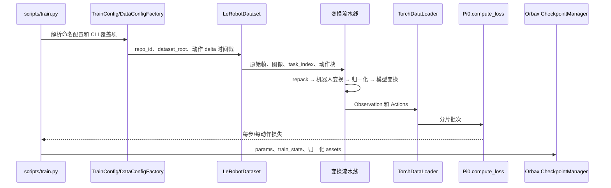
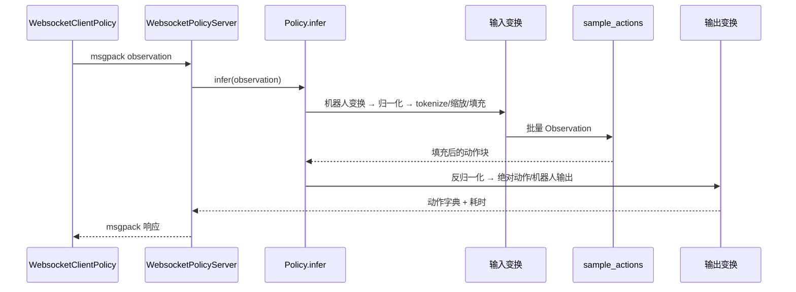

# 架构

## 分层与职责

本仓库将机器人约定与模型约定分离：

1. `DataConfigFactory` 选择数据集字段并组合变换。
2. 机器人策略变换将环境专用字典转换为统一的 `Observation`/`Actions` 结构。
3. 模型变换负责 prompt tokenization、图像缩放和 state/action 维度填充。
4. `BaseModel` 实现负责损失函数与动作采样器。
5. `Policy` 在推理前后应用同一组变换，并公开字典接口。
6. 服务端和客户端包只传输这些字典，不解释机器人语义。

这一分层是适配新机器人的主要扩展点。数据集 repack 仅用于训练，而 `data_transforms` 和 `model_transforms` 会在推理时复用。因此，环境输入必须匹配机器人变换所期望的 repack 后字段，不一定与原始数据集字段相同。

## 训练批次路径

`scripts/train.py:main` 创建 JAX mesh 和数据加载器，初始化权重，JIT 编译 `train_step`，随后反复调用 `BaseModel.compute_loss`。`train_step` 对模型损失取平均，只对 `TrainConfig.trainable_filter` 选中的参数求导，应用 Optax 更新，并可选地更新 EMA 参数。每次优化后读取下一批数据。检查点采用异步保存；启用 EMA 时，EMA 参数作为推理用 `params` 保存。

LeRobot 加载器根据数据集 FPS 和模型 `action_horizon` 为每个字段生成 `delta_timestamps`，以读取未来动作样本。`PromptFromLeRobotTask` 在仅训练使用的 repack 阶段之前，将 `task_index` 解析为字符串。

## 推理请求路径

`create_trained_policy` 根据命名 `TrainConfig` 重建模型，通过是否存在 `model.safetensors` 判断 PyTorch 检查点，并从检查点 assets 而不是训练 assets 目录加载归一化统计量。`Policy.infer` 复制并变换单条 observation，添加 batch 维，采样动作块，移除 batch 维，再按语义逆序应用输出变换。

WebSocket 服务器在连接建立后立即发送策略元数据。请求使用内置 NumPy msgpack codec 解码，每个连接内串行处理，并随响应返回服务端耗时。传输层不校验机器人专用张量形状；该职责属于策略变换和客户端。

## 配置耦合

训练和服务都必须使用同一个命名训练配置。以下值必须保持一致：

- 模型类型、`action_dim`、`action_horizon` 和 prompt token 长度；
- 机器人变换和动作表示；
- 归一化统计量使用的 `asset_id`；
- 检查点参数结构和模型变体；
- 客户端 observation 字段与变换期望的推理字段。

仅修改客户端或仅修改数据集 repack 映射都不够，因为训练与推理共享机器人变换和模型变换。

## 扩展点与风险

- 为新机器人增加 `DataConfigFactory` 以及输入/输出变换对。
- 在 `_CONFIGS` 中增加 `TrainConfig`；名称必须唯一。
- 使用 `AssetsConfig` 复用兼容的预训练统计量，或重新计算统计量。
- 无需修改模型代码即可实现新的 `BasePolicy` 客户端。
- 只有设备数量与参数轴满足分片逻辑的整除要求时，才能增大 `fsdp_devices`。

影响最大的风险包括：动作顺序错误、对错误维度执行 delta 转换、使用另一种动作约定生成的归一化统计量，以及用不匹配的配置加载检查点。
